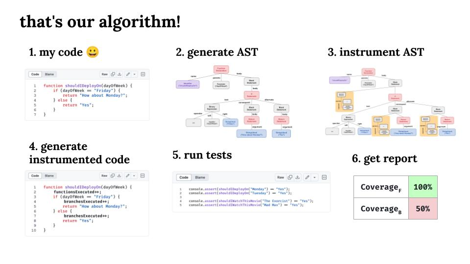

# 🧪 Hands-on Code Coverage in Javascript and Clojure

  

Modern code coverage tools assess the coverage of statements, branches and functions, metrics more precise than number of lines, traversing the AST to instrument the code.

This repository contains two toy models - for Javascript and Clojure - to understand how code coverage libraries such as [IstanbulJS](https://github.com/istanbuljs/istanbuljs) and [Cloverage](https://github.com/cloverage/cloverage) do that.

The idea of the algorithm is the same in both languages:

1. 📖 Read the code
2. 🌳 Generate an AST
3. 🔍 Traverse the AST instrumenting statements
4. ⚙️ Generate the instrumented add the code
5. 🧪 Run tests
6. 📊 Generate a report

## 🟨 Javascript

To complete the coverage tool for Javascript, there's only 4 tasks:

1. Generate the AST from code
2. Implement the instrumentation for IfStatement
3. Generate the instrumented code from AST and write to instrumented-code.js
4. Create a report

To do "compiler" operations, such as generate an AST given a code, we use [Babel](https://github.com/babel/babel) (just like IstanbulJS!). Babel gives for us some useful functions, like:
- `parse`: Literally the parser of a front-end compiler (Babel is a compiler indeed), so it returns an AST given a Javascript code.
- `traverse` : We can traverse through the AST and pass a visitor function, to apply the right treatment for each type of node.
- `generate`: generate the code given an AST.

## 🟪 Clojure

For Clojure, the implementation is almost complete, except it check the cover for branches only. If you want to implement it for functions, check the [tools.analyzer.jvm AST Quickref](https://clojure.github.io/tools.analyzer.jvm/spec/quickref.html) to understand the nodes that compose a function declaration.

Here, to do AST operations we use [tools.analyzer](https://github.com/clojure/tools.analyzer) and
 [tools.analyzer.jvm](https://github.com/clojure/tools.analyzer.jvm).

There are some particularities in the implementation in comparison with JS - to store the counter state, we need to use atoms. Moreover, we can make use of the set data structure (and don't worry with repeated values).